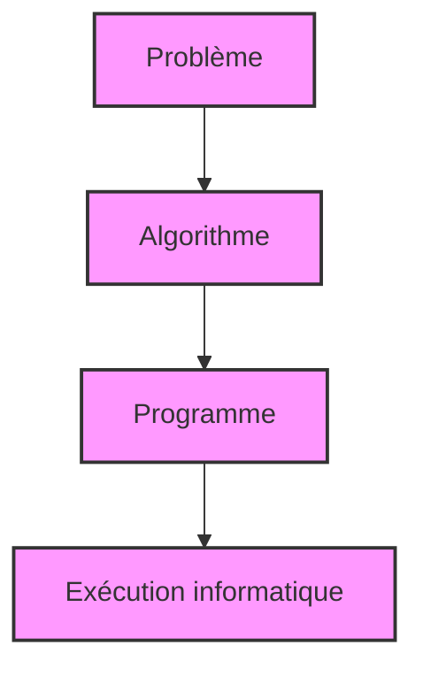

# Introduction à l’algorithmique  
## Notion de problème, algorithme et programme  
### Définition et différences entre problème, algorithme et programme

Dans le domaine de l'informatique et plus particulièrement de la programmation, il est fondamental de distinguer trois notions fondamentales : **le problème**, **l'algorithme** et **le programme**. Ces concepts, bien que liés, désignent des réalités différentes que nous allons clarifier à travers des définitions précises, des exemples concrets et une illustration sous forme de diagramme.

---

## 1. Le Problème

Un **problème** est une question à résoudre. C’est une situation ou une tâche qui nécessite une solution spécifique. En informatique, un problème algorithmique est formalisé par :

- Les données d'entrée (ce que l’on connaît ou reçoit)
- La condition attendue sur la sortie (le résultat recherché)

Le problème pose un objectif clair à atteindre : transformer des entrées données en une sortie souhaitée.

**Exemple simple** :  
Problème : Trouver le plus grand nombre dans une liste d'entiers.

---

## 2. L’Algorithme

Un **algorithme** est un ensemble fini d’instructions ou d’étapes clairement définies permettant de résoudre un problème. C’est une méthode ou un plan pour passer des entrées à la sortie attendue. 

Un algorithme doit posséder trois caractéristiques essentielles :

- **Finitude** : Il finit toujours après un nombre fini d'étapes.
- **Clarté** : Chaque étape est précise et non ambiguë.
- **Efficacité** : Il doit résoudre le problème en un temps raisonnable et avec un coût de mémoire contrôlé.

**Exemple d'algorithme** : Pour le problème précédent (trouver le maximum dans une liste), un algorithme peut être :

1. Initialiser une variable `max` avec le premier élément de la liste.
2. Pour chaque élément de la liste :
    - Si l’élément est supérieur à `max`, alors remplacer `max` par cet élément.
3. À la fin, `max` contient le plus grand nombre.

---

## 3. Le Programme

Un **programme** est l’implémentation concrète de l’algorithme dans un langage informatique exécutable par un ordinateur. Il traduit les étapes de l’algorithme en code source qui sera ensuite compilé ou interprété.

Le programme fait le lien entre la théorie (algorithme) et la pratique (exécution sur machine).

**Exemple en Python** pour trouver le maximum :

```python
def trouver_max(liste):
    max_val = liste[0]
    for element in liste:
        if element > max_val:
            max_val = element
    return max_val

# Exemple d'utilisation
print(trouver_max([3, 7, 2, 9, 5]))  # Affiche 9
```

---

## Résumé sous forme de diagramme Mermaid



- Le **problème** définit *quoi* doit être résolu.
- L’**algorithme** décrit *comment* le résoudre par étapes.
- Le **programme** est la traduction de l’algorithme en un code exécutable.

---

## Conclusion

Comprendre la distinction entre problème, algorithme et programme permet une meilleure maîtrise des processus de résolution en informatique. Cet enchaînement logique va de la définition abstraite du problème à la solution concrète implémentée et exécutée.  

---

## Sources utilisées

- [Loud Technology - Définition Algorithm](https://loud-technology.com/programmation/definitions/algorithm/)
- [Wikipedia - Problème algorithmique](https://fr.wikipedia.org/wiki/Probl%C3%A8me_algorithmique)
- [PyRat - Différence entre problème, algorithme et programme](http://formations.telecom-bretagne.eu/pyrat/?p=110)

Ces sources fournissent des définitions précises et une réflexion complémentaire qui ont guidé cet article.