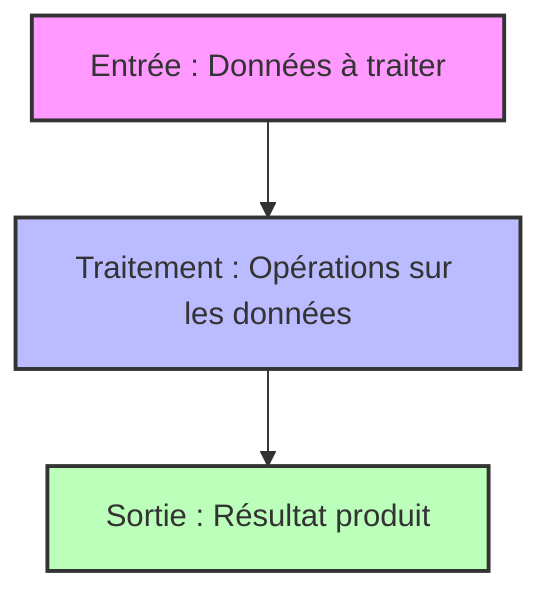

# Introduction à l’algorithmique  
## Structure générale d’un algorithme  
### Présentation des différentes parties d'un algorithme (entrée, traitement, sortie)

Un algorithme, quel que soit son domaine d’application, suit une structure générale commune. Cette structure se compose principalement de trois parties essentielles : **l’entrée**, **le traitement**, et **la sortie**. Comprendre cette division permet de mieux concevoir, organiser et analyser un algorithme avant même de passer à l’implémentation.

---

## 1. Entrée (Input)

L'**entrée** correspond aux données initiales fournies à l'algorithme. Ces données représentent les informations nécessaires pour que l'algorithme puisse fonctionner.

- Ce sont les paramètres, variables, ou valeurs que l’on fournit.
- L’algorithme dépend de ces données pour produire un résultat.
- Elles peuvent être fixes (hardcodées), fournies par l’utilisateur, lues depuis un fichier, une base de données, etc.

**Exemple** : Pour un algorithme qui calcule la moyenne d’une liste de nombres, l’entrée est la liste des nombres.

---

## 2. Traitement (Process)

Le **traitement** est le cœur de l’algorithme. C’est l’ensemble des opérations, des calculs ou manipulations effectuées sur les données d’entrée pour produire une information utile.

- C’est la résolution proprement dite du problème.
- Cette phase peut inclure des boucles, des conditions, des appels à des sous-algorithmes.
- Les opérations peuvent être arithmétiques, logiques, ou liées à la gestion de données.

**Exemple** : Dans le calcul de la moyenne, le traitement consiste à additionner les nombres de la liste, puis à diviser la somme par le nombre d’éléments.

---

## 3. Sortie (Output)

La **sortie** est le résultat produit par l’algorithme après traitement.

- Elle représente la réponse au problème posé.
- Elle peut être un nombre, un texte, une structure de données, ou un ensemble de résultats.
- La sortie peut être affichée, enregistrée, transmise à un autre programme.

**Exemple** : La moyenne calculée dans notre exemple est la sortie.

---

## Illustration avec un exemple concret

Considérons un algorithme simple qui calcule la somme des entiers d'une liste.

| Partie    | Description                                                   |
|-----------|---------------------------------------------------------------|
| Entrée    | Liste de nombres, par exemple : [2, 5, 8, 3]                   |
| Traitement| Additionner tous les éléments de la liste                      |
| Sortie    | Valeur entière représentant la somme, ici 18                  |

---

## Représentation en diagramme Mermaid



---

## Exemple complet en pseudo-code

```
Algorithme CalculSomme
    Entrée : liste_nombres
    Traitement :
        somme = 0
        Pour chaque nombre dans liste_nombres
            somme = somme + nombre
    Sortie : somme
Fin Algorithme
```

---

## Sources utilisées

- [OpenClassrooms - Les bases de l’algorithmique](https://openclassrooms.com/fr/courses/6204541-initiez-vous-a-lalgorithmique/6261876-decouvrez-la-structure-general-dun-algorithme)  
- [Wikipedia - Algorithmique](https://fr.wikipedia.org/wiki/Algorithmique#Structure_g%C3%A9n%C3%A9rale_d%27un_algorithme)  
- [Developpez.com - Introduction à l’algorithmique](https://algorithme.developpez.com/cours/intro/)  

---

En résumé, la structure entrée-traitement-sortie est un cadre simple mais fondamental pour structurer tout algorithme. Cette architecture facilite la compréhension, la conception et la maintenance des solutions informatiques.