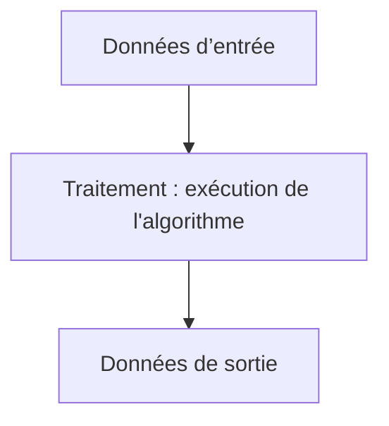

# Introduction à l’algorithmique  
## Données d’entrée / sortie  
### Compréhension du rôle des données d’entrée et de sortie dans un algorithme

Dans un algorithme, les **données d’entrée** et les **données de sortie** jouent un rôle clé. Elles définissent respectivement ce que l’on fournit comme informations pour résoudre un problème et ce que l’algorithme produit comme résultat. La compréhension précise de ces concepts permet de mieux cadrer et structurer une solution algorithmique.

---

## 1. Données d’entrée : fondement de l’algorithme

Les **données d’entrée** sont les informations initiales que l’algorithme reçoit et sur lesquelles il va travailler. Elles représentent le "point de départ" indispensable.

- Elles peuvent être de différents types : nombres, chaînes de caractères, listes, structures plus complexes.
- Elles doivent être clairement spécifiées pour que l’algorithme soit applicable.
- Elles conditionnent en partie la complexité et la nature du traitement.

### Exemple  
Un algorithme de recherche dans une liste a comme entrées :  
- La liste dans laquelle chercher  
- La valeur à rechercher

---

## 2. Données de sortie : résultat attendu

Les **données de sortie** sont les informations que l’algorithme produit après traitement des données d’entrée. C’est la réponse au problème posé.

- La sortie doit correspondre aux attentes définies lors de la formalisation du problème.
- Elle permet de valider la pertinence de l’algorithme.

### Exemple  
Pour l’algorithme de recherche, la sortie peut être :  
- L’indice de la valeur trouvée dans la liste,  
- Ou un indicateur que la valeur n’est pas présente.

---

## 3. Interaction entrée / traitement / sortie

L’algorithme devient alors un mécanisme transformant des entrées en sorties. Cette transformation doit être claire, fiable et reproductible.  
- On peut représenter ce processus comme une "boîte noire" :  
Entrée → Traitement (algorithme) → Sortie

---

## Exemple concret : calcul de la moyenne

| Élément             | Description                                 |
|---------------------|---------------------------------------------|
| Données d’entrée    | Liste de nombres, ex : [4, 8, 15, 16, 23]   |
| Traitement         | Calculer la somme, diviser par le nombre d’éléments |
| Données de sortie   | Nombre à virgule flottante représentant la moyenne |

---

## Diagramme Mermaid illustrant le flux d’un algorithme

---

## Importance des entrées et sorties dans la conception

- **Spécification claire des entrées** évite les ambiguïtés et simplifie le contrôle des erreurs.  
- **Définition précise des sorties** clarifie l’objectif et facilite la validation.

---

## Sources utilisées

- [OpenClassrooms - Comprendre les entrées et sorties d’un algorithme](https://openclassrooms.com/fr/courses/6204541-initiez-vous-a-lalgorithmique/6262531-les-donnees-dentree-et-de-sortie)  
- [Wikipedia - Algorithmique](https://fr.wikipedia.org/wiki/Algorithmique#Donn%C3%A9es_d'entr%C3%A9e_et_de_sortie)  
- [Developpez.com - Algorithmique : données en entrée et sortie](https://algorithme.developpez.com/cours/introduction/#Donnees)  

---

Maîtriser le rôle des données d’entrée et de sortie permet de structurer un algorithme précis et opérationnel, formant la base solide de toute solution informatique.