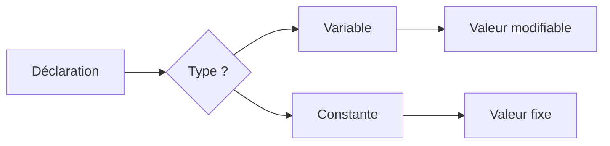

# Types de données et expressions  
## Variables et constantes  
### Définition et utilisation des variables et constantes

Dans la programmation, les **variables** et les **constantes** sont des éléments fondamentaux qui permettent de stocker et manipuler des données. Bien comprendre leur définition et leur usage est indispensable pour écrire des algorithmes clairs, efficaces et maintenables.

---

## 1. Variables : stockage de données modifiables

Une **variable** est une zone de mémoire à laquelle on associe un nom symbolique, permettant de stocker une information pouvant varier au cours de l’exécution du programme.

- Permet de stocker différents types de données : entiers, réels, chaînes de caractères, etc.
- Sa valeur peut être modifiée à tout moment.
- Le nom d’une variable doit être explicite dans l’idéal, pour faciliter la compréhension du code.

### Exemple

En pseudo-code :

```
variable age = 25
age = age + 1  // mise à jour de la valeur de la variable
```

Cette variable `age` peut évoluer au cours du programme.

---

## 2. Constantes : stockage de données immuables

Une **constante** est une donnée nommée dont la valeur est fixée une fois pour toutes, et ne peut pas être modifiée pendant l'exécution.

- Utilisée pour représenter des valeurs fixes (ex. : π, nombre maximal d’éléments, taux fixe).
- Améliore la lisibilité et la sécurité du code car évite les modifications accidentelles.

### Exemple

En pseudo-code :

```
constante PI = 3.14159
```

`PI` pourra être utilisée dans des calculs sans risque que sa valeur soit altérée.

---

## 3. Comparaison et rôle dans un algorithme

| Aspect        | Variable                          | Constante                    |
|---------------|---------------------------------|------------------------------|
| Valeur        | Modifiable                      | Fixe                         |
| Usage         | Données dynamiques               | Données fixes et invariables |
| Syntaxe       | `variable nom = valeur`          | `constante nom = valeur`      |
| Exemples      | Compteurs, résultats intermédiaires | Paramètres fixes du problème |

L’usage judicieux de variables et constantes garantit un algorithme robuste, clair et modulable.

---

## Illustration Mermaid : Cycle de vie des variables et constantes



---

## Exemple concret : calcul de l’aire d’un cercle

```pseudo
constante PI = 3.14159
variable rayon = 5
variable aire = PI * rayon * rayon
```

Ici, `PI` est constante car c’est une valeur universelle, tandis que `rayon` peut changer si on veut calculer l’aire d’un autre cercle.

---

## Sources utilisées

- [OpenClassrooms - Variables et constantes](https://openclassrooms.com/fr/courses/1946386-programmez-avec-python/1946465-utilisez-les-variables)
- [Wikipedia - Variable (informatique)](https://fr.wikipedia.org/wiki/Variable_(informatique))
- [Developpez.com - Variables et constantes](https://cpp.developpez.com/cours/variables_constantes/)

---

Maîtriser la distinction entre variables et constantes permet d’écrire des algorithmes plus compréhensibles, sûrs, et modulables en facilitant la gestion des données.