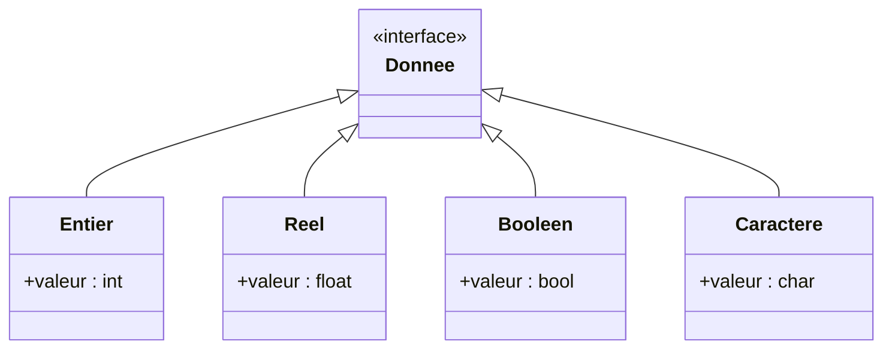

# Types de données et expressions  
## Types de base  
### Les types : entier, réel, booléen, caractère

Dans la programmation et l’algorithmique, les **types de données** définissent la nature des valeurs que l’on manipule. Quatre types fondamentaux sont régulièrement utilisés : **entier**, **réel**, **booléen**, et **caractère**. Savoir les distinguer et comprendre leurs usages est nécessaire pour manipuler efficacement les données.

---

## 1. Type entier (`int`)

Le type **entier** représente les nombres sans partie décimale, positifs ou négatifs.

- Utilisé pour compter, indexer, gérer des quantités discrètes.
- En informatique, la taille mémoire (en bits) détermine la plage possible. Par exemple, un entier 32 bits peut représenter environ de -2 milliards à +2 milliards.

### Exemple

```pseudo
variable age : entier = 30
variable compteur : entier = 0
```

---

## 2. Type réel (`float` ou `double`)

Le type **réel** (ou à virgule flottante) sert à représenter les nombres avec une partie décimale.

- Permet la gestion de valeurs continues, précises.
- Utilisé en calcul scientifique, géométrie, statistiques.

### Exemple

```pseudo
variable temperature : réel = 23.5
variable pi : réel = 3.14159
```

---

## 3. Type booléen (`bool`)

Le type **booléen** peut prendre uniquement deux valeurs : **vrai** ou **faux**.

- Utilisé pour expressions logiques, conditions, contrôles de flux.
- Permet de gérer la logique binaire dans les programmes.

### Exemple

```pseudo
variable est_adulte : booléen = vrai
variable est_connecte : booléen = faux
```

---

## 4. Type caractère (`char`)

Le type **caractère** représente un seul symbole, lettre ou chiffre.

- Utilisé pour la manipulation de textes, l'identification de symboles.
- Un caractère est souvent stocké sous forme d’un code numérique (ex. ASCII, Unicode).

### Exemple

```pseudo
variable initiale : caractère = 'A'
variable symbole : caractère = '#'
```

---

## Résumé des types de base

| Type       | Description                      | Exemple de valeurs          | Usage principal                  |
|------------|--------------------------------|----------------------------|---------------------------------|
| Entier     | Nombres sans décimale           | 0, -5, 42                  | Comptage, index, opérations exactes |
| Réel       | Nombres à partie décimale       | 3.14, -0.001, 98.6         | Mesures, calculs précis          |
| Booléen    | Vrai ou faux                   | vrai, faux                  | Conditions, contrôles            |
| Caractère  | Un seul caractère               | 'A', 'z', '9', '#'          | Manipulation textuelle           |

---

## Diagramme Mermaid illustrant la relation entre types



---

## Exemple d’utilisation dans un algorithme simple

Calculer l’aire d’un cercle et vérifier si elle dépasse un seuil

```pseudo
constante PI = 3.14159
variable rayon : réel = 5.0
variable aire : réel
variable seuil : réel = 50.0
variable est_grand : booléen

aire = PI * rayon * rayon
est_grand = (aire > seuil)
```

---

## Sources utilisées

- [OpenClassrooms - Les types de base](https://openclassrooms.com/fr/courses/1946386-programmez-avec-python/1946501-comprendre-les-types-de-donnees)  
- [Wikipedia - Type de données (informatique)](https://fr.wikipedia.org/wiki/Type_de_donn%C3%A9e)  
- [Developpez.com - Types de données](https://cours-de-programmation.com/cours/bases/types-de-donnees/)  

---

La maîtrise des types de données élémentaires est un fondement pour construire des algorithmes pertinents et performants, permettant de manipuler efficacement des informations variées.