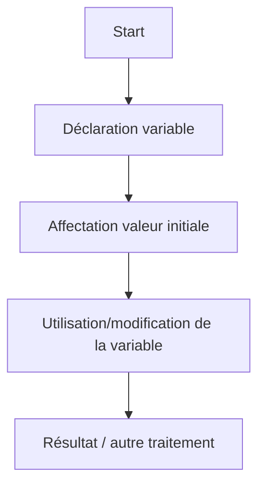

# Instructions simples et conditionnelles  
## Affectation  
### Notion et syntaxe de l’affectation en pseudo-code

L’**affectation** est une des opérations de base en algorithmique. Elle consiste à **donner une valeur à une variable**. Cette action permet au programme de stocker, modifier et utiliser des données tout au long de son exécution.

---

## 1. Définition de l’affectation

L’affectation consiste à associer une valeur à une variable. Cette association remplace la valeur précédente de la variable si elle existait. Elle ne doit pas être confondue avec l’égalité mathématique : il s’agit d’un **processus dynamique** indiquant que la variable prendra la valeur spécifiée.

---

## 2. Syntaxe classique en pseudo-code

```pseudo
variable ← expression
```

- Le symbole `←` ou `=` (selon les conventions) est utilisé pour signifier "affecter" ou "donner la valeur".
- `variable` est un nom symbolique représentant la zone de stockage mémoire.  
- `expression` est une valeur ou un calcul dont le résultat sera assigné.

---

## 3. Exemples d’affectation simples

```pseudo
age ← 25
nom ← "Alice"
total ← prix * quantité
```

- Ici `age` reçoit la valeur 25.  
- `nom` reçoit la chaîne de caractères "Alice".  
- `total` est calculé en multipliant `prix` par `quantité` puis affecté.

---

## 4. Exemple d’évolution d’une variable

```pseudo
compteur ← 0
compteur ← compteur + 1    // Incrémente la valeur de compteur
```

L’affectation modifie la valeur de `compteur` à chaque ligne. Cette reconstruction progressive permet de gérer des états dans l’algorithme.

---

## 5. Représentation graphique (diagramme Mermaid)



---

## 6. Précisions importantes

- L’affectation ne réalise pas une comparaison, donc `variable = expression` s’interprète comme une modification, pas une vérification d’égalité.  
- En pseudo-code, l’usage de la flèche `←` est préféré pour éviter toute confusion.  
- L’expression peut être simple (valeur directe) ou complexe (résultat d’un calcul ou d’une fonction).

---

## 7. Synthèse en tableau

| Élément           | Description                                | Exemple                   |
|-------------------|--------------------------------------------|---------------------------|
| Variable          | Nom symbolique représentant une donnée    | `age`                    |
| Opérateur d’affectation | Donne une valeur à la variable          | `←` ou `=`               |
| Valeur ou expression | Nombre, chaîne, calcul, etc.               | `25`, `"Bonjour"`, `a+b`  |

---

## Sources utilisées

- [OpenClassrooms - Introduction à l’algorithmique : variables et affectations](https://openclassrooms.com/fr/courses/6204541-initiez-vous-a-lalgorithmique/6262531-les-donnees-dentree-et-de-sortie)  
- [Wikipedia - Instruction d’affectation](https://fr.wikipedia.org/wiki/Affectation_(informatique))  
- [Developpez.com - Initiation à l’algorithmique (affectation)](https://algorithmique.developpez.com/cours/variables/#Affection)  

---

La maîtrise de la notion d’affectation en pseudo-code est le fondement sur lequel s’appuient toutes les manipulations de données dans un algorithme. Cela rend possible le suivi et la mise à jour des informations nécessaires au traitement.