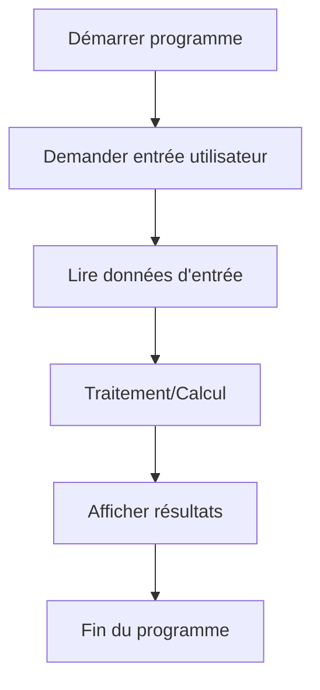

# Instructions simples et conditionnelles  
## Entrées / sorties  
### Principes des opérations d’entrée et de sortie

Les opérations d’**entrée** et de **sortie** sont des mécanismes indispensables pour communiquer entre un programme et son environnement externe, qu’il s’agisse de l’utilisateur, d’un fichier, ou d’un autre système. Ces opérations permettent de récupérer des données pour les traiter (entrée) et d’afficher ou transmettre des résultats (sortie).

---

## 1. Opérations d’entrée

L’**entrée** consiste à recueillir des données provenant de l’extérieur du programme. En algorithmique simple, cela correspond souvent à lire une valeur saisie par un utilisateur.

### Principes

- Permet au programme d’obtenir des informations dynamiques.  
- La donnée d’entrée va généralement être stockée dans une variable.  
- Le type et la nature des données doivent être respectés (nombre, texte, booléen...).

### Exemple en pseudo-code

```pseudo
Lire age
Lire nom
```

Ici, le programme attend la saisie d’un âge et d’un nom, puis stocke ces données pour utilisation ultérieure.

---

## 2. Opérations de sortie

La **sortie** a pour but de présenter des résultats à l’utilisateur ou de transmettre des informations.

### Principes

- Permet de rendre compte des calculs, messages, ou états du programme.  
- S'effectue généralement via l’affichage à l’écran ou l’écriture dans un fichier.  
- Peut concerner des données simples ou plus complexes (tableaux, structures).

### Exemple en pseudo-code

```pseudo
Afficher "Bonjour " + nom
Afficher "Votre âge est " + age
```

Des messages sont affichés, combinant texte statique et contenu dynamique.

---

## 3. Interaction entre entrée et sortie

Souvent, un programme suit ce schéma basique :

1. **Entrée** des données (saisie utilisateur).  
2. **Traitement** des données (calculs, décisions).  
3. **Sortie** des résultats.

---

## 4. Diagramme Mermaid : schéma des opérations I/O



---

## 5. Points de vigilance

- Les données saisies doivent être contrôlées pour éviter erreurs (ex. : type incorrect, valeurs hors intervalle).  
- La sortie doit être claire et informative, offrant un retour utile.  
- En programmation avancée, les opérations d’entrée/sortie peuvent concerner des flux multiples et formats divers (fichiers, réseau).

---

## Sources utilisées

- [OpenClassrooms - Input/Output en algorithmique](https://openclassrooms.com/fr/courses/6204541-initiez-vous-a-lalgorithmique/6262611-les-operations-dentree-et-de-sortie)  
- [Wikipedia - Entrée-sortie informatique](https://fr.wikipedia.org/wiki/Entr%C3%A9e-sortie_(informatique))  
- [Developpez.com - Tutorial algorithmique : entrée et sortie](https://algorithmique.developpez.com/cours/principes/#IO)  

---

Les opérations d’entrée et de sortie sont le point d’interaction entre un algorithme et son environnement. Comprendre et maîtriser ces mécanismes permet d’écrire des algorithmes interactifs et fonctionnels.