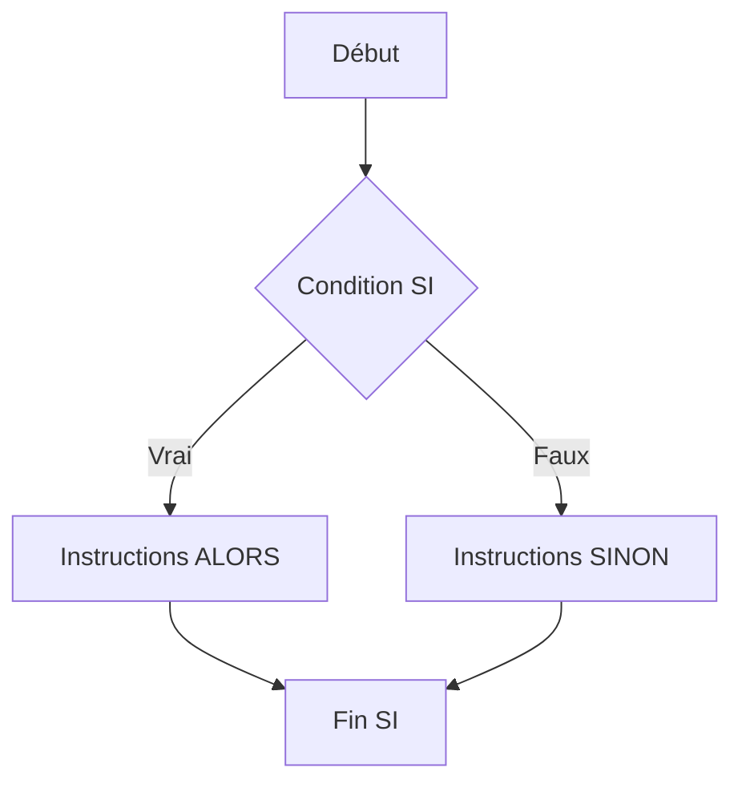

# Instructions simples et conditionnelles  
## Structures conditionnelles  
### Instructions conditionnelles SI … ALORS, SI … ALORS … SINON, SELON … FAIRE

Les structures conditionnelles permettent à un algorithme de **prendre des décisions en fonction de conditions**. Elles contrôlent le flux d’exécution en évaluant des expressions logiques et en choisissant les actions à réaliser selon leur résultat.

---

## 1. La structure SI … ALORS

La structure **SI … ALORS** teste une condition et exécute un bloc d’instructions uniquement si cette condition est vraie.

### Syntaxe en pseudo-code

```pseudo
SI condition ALORS
    instructions
FIN SI
```

### Exemple

```pseudo
SI age >= 18 ALORS
    Afficher "Vous êtes majeur."
FIN SI
```

Ici, le message s’affiche seulement si la personne est majeure.

---

## 2. La structure SI … ALORS … SINON

Elle ajoute une alternative : si la condition est fausse, un autre bloc d’instructions est exécuté.

### Syntaxe

```pseudo
SI condition ALORS
    instructions_si_vrai
SINON
    instructions_si_faux
FIN SI
```

### Exemple

```pseudo
SI age >= 18 ALORS
    Afficher "Vous êtes majeur."
SINON
    Afficher "Vous êtes mineur."
FIN SI
```

L'algorithme adapte le message selon l’âge.

---

## 3. La structure SELON … FAIRE

Elle simplifie le traitement lorsque plusieurs cas doivent être traités en fonction d’une même variable. Cette structure est souvent appelée **switch** dans certains langages.

### Syntaxe en pseudo-code

```pseudo
SELON variable FAIRE
    CAS valeur1:
        instructions1
    CAS valeur2:
        instructions2
    ...
    CAS SINON:
        instructions_par_defaut
FIN SELON
```

### Exemple

```pseudo
SELON jour_de_la_semaine FAIRE
    CAS "lundi":
        Afficher "Début de semaine"
    CAS "vendredi":
        Afficher "Fin de semaine"
    CAS SINON:
        Afficher "Jour ordinaire"
FIN SELON
```

---

## 4. Diagramme Mermaid illustrant le flux conditionnel



Pour un **SELON … FAIRE**, le flux se divise en plusieurs branches selon les cas.

---

## 5. Bonnes pratiques

- Toujours prévoir un cas **SINON** ou un **CAS SINON** pour gérer les situations inattendues.  
- Limiter la complexité des conditions pour garder le code lisible.  
- Utiliser les structures conditionnelles pour modéliser des choix clairs et déterministes.

---

## Sources utilisées

- [OpenClassrooms - Structures conditionnelles](https://openclassrooms.com/fr/courses/6204541-initiez-vous-a-lalgorithmique/6262651-les-structures-conditionnelles)  
- [Wikipedia - Instruction conditionnelle](https://fr.wikipedia.org/wiki/Instruction_conditionnelle)  
- [Developpez.com - Conditions en algorithmique](https://algorithmique.developpez.com/cours/conditions/#Conditions_si)  

---

Les structures conditionnelles sont le fondement pour orienter l’exécution des algorithmes selon des critères précis. Leur maîtrise facilite la gestion des cas variés et rend le programme dynamique et adapté aux situations réelles.