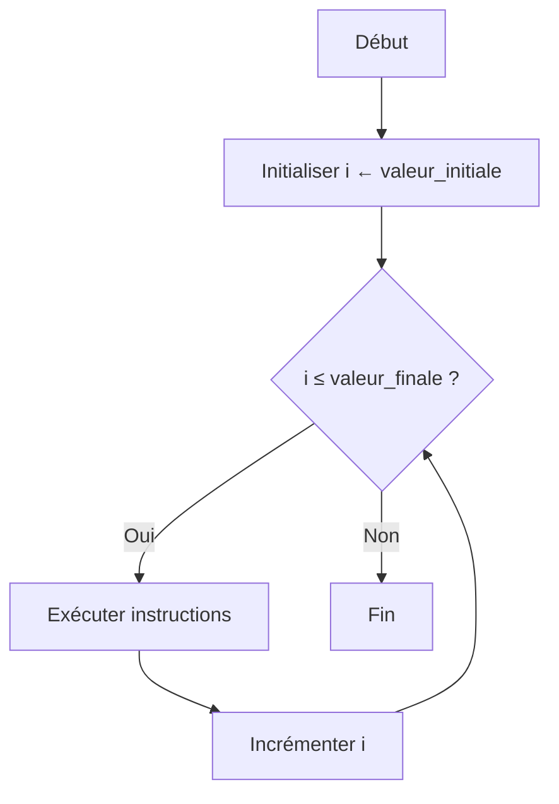

# Structures itératives  
## Boucle POUR  
### Utilisation de la boucle POUR pour des itérations définies

La boucle **POUR** est une structure itérative utilisée pour répéter un bloc d’instructions un nombre précis de fois. Elle facilite les traitements répétitifs lorsque l'on connaît à l'avance le nombre d’itérations.

---

## 1. Concept de la boucle POUR

La boucle **POUR** itère en faisant varier une variable de contrôle (souvent appelée compteur) dans un intervalle défini, exécutant à chaque fois le bloc d’instructions associé.

Cette variable évolue de manière ordonnée (souvent de 1 à N) et permet d’adresser facilement chaque itération.

---

## 2. Syntaxe classique en pseudo-code

```pseudo
POUR variable DE valeur_initiale A valeur_finale FAIRE
    instructions
FIN POUR
```

- `variable` est un entier initialisé à `valeur_initiale`.  
- À chaque itération, `variable` est incrémentée de 1 (par défaut).  
- La boucle s’arrête après exécution lorsque `variable` dépasse `valeur_finale`.

---

## 3. Exemple simple

Affichage des nombres de 1 à 5 :

```pseudo
POUR i DE 1 A 5 FAIRE
    Afficher i
FIN POUR
```

Chaque itération affiche la valeur courante de `i` : 1, 2, 3, 4, 5.

---

## 4. Exemple avec calcul

Calcul de la somme des entiers de 1 à 10 :

```pseudo
somme ← 0
POUR i DE 1 A 10 FAIRE
    somme ← somme + i
FIN POUR
Afficher "La somme est " + somme
```

Le résultat affiché sera : "La somme est 55".

---

## 5. Variante avec pas de boucle

Certaines syntaxes permettent d’incrémenter la variable par un pas autre que 1.

```pseudo
POUR j DE 0 A 10 PAS 2 FAIRE
    Afficher j
FIN POUR
```

Ici, `j` prendra les valeurs 0, 2, 4, 6, 8, 10.

---

## 6. Diagramme Mermaid illustrant la boucle POUR



---

## 7. Points importants

- La variable de boucle est locale à la boucle (selon contexte).  
- Veiller à bien définir les bornes pour éviter les boucles infinies.  
- La boucle **POUR** est adaptée quand le nombre d’itérations est connu à l’avance.

---

## Sources utilisées

- [OpenClassrooms - Boucles et itérations](https://openclassrooms.com/fr/courses/6204541-initiez-vous-a-lalgorithmique/6262636-les-boucles)  
- [Wikipedia - Structure itérative POUR](https://fr.wikipedia.org/wiki/Boucle_for)  
- [Developpez.com - Boucle for en algorithmique](https://algorithmique.developpez.com/cours/boucles/#Boucles_pour)  

---

La boucle **POUR** est une structure simple et efficace pour réaliser des répétitions déterminées, très utilisée dans le traitement algorithmique des séquences et l'automatisation de calculs répétitifs.