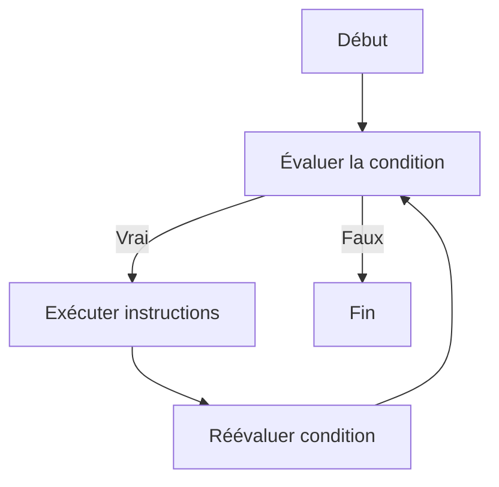

# Structures itératives  
## Boucle TANT QUE  
### Utilisation de la boucle TANT QUE pour des conditions de continuation

La boucle **TANT QUE** permet de répéter un bloc d’instructions tant qu'une condition spécifiée reste vraie. Contrairement à la boucle **POUR** où le nombre d’itérations est connu à l’avance, la boucle **TANT QUE** est axée sur une condition de continuation, idéale pour des répétitions dont la fin dépend d’un état dynamique.

---

## 1. Concept de la boucle TANT QUE

La structure exécute en boucle son contenu tant que la condition évaluée en début de chaque cycle est vérifiée (vraie). Si la condition devient fausse, la boucle se termine.

Cette forme est particulièrement adaptée aux situations où on ne sait pas par avance le nombre d’itérations nécessaires.

---

## 2. Syntaxe en pseudo-code

```pseudo
TANT QUE condition FAIRE
    instructions
FIN TANT QUE
```

- `condition` est une expression booléenne.  
- Si `condition` est vraie, les `instructions` sont exécutées puis la condition est réévaluée.  
- Si `condition` est fausse, la boucle s’interrompt.

---

## 3. Exemple simple

Supposons qu’on souhaite afficher les nombres de 1 à 5.

```pseudo
i ← 1
TANT QUE i <= 5 FAIRE
    Afficher i
    i ← i + 1
FIN TANT QUE
```

Chaque itération affiche la valeur courante de `i` et l’incrémente jusqu’à ce que la condition `i <= 5` soit fausse.

---

## 4. Exemple avec saisie utilisateur

On continue de demander à l’utilisateur un nombre tant qu’il est négatif.

```pseudo
nombre ← -1
TANT QUE nombre < 0 FAIRE
    Afficher "Entrez un nombre positif :"
    Lire nombre
FIN TANT QUE
Afficher "Merci, vous avez entré " + nombre
```

La boucle garantit une entrée valide en contrôlant la condition.

---

## 5. Diagramme Mermaid illustrant la boucle TANT QUE



---

## 6. Précautions d’usage

- Assurez-vous que la condition sera éventuellement fausse pour éviter les **boucles infinies**.  
- Modifier au moins une variable dans la boucle liée à la condition pour garantir sa modification.  
- La boucle TANT QUE peut ne pas s’exécuter si la condition est fausse dès la première évaluation (zéro ou plusieurs itérations).

---

## Sources utilisées

- [OpenClassrooms - Les boucles TANT QUE](https://openclassrooms.com/fr/courses/6204541-initiez-vous-a-lalgorithmique/6262636-les-boucles#tant-que)  
- [Wikipedia - Boucle while](https://fr.wikipedia.org/wiki/Boucle_while)  
- [Developpez.com - Algorithmique boucle TANT QUE](https://algorithmique.developpez.com/cours/boucles/#Boucles_tant_que)  

---

La boucle **TANT QUE** est une structure flexible adaptée aux situations où la répétition dépend d’une condition externe ou interne, très utilisée dans les traitements interactifs et les algorithmes où la durée de la répétition n’est pas prédéfinie.