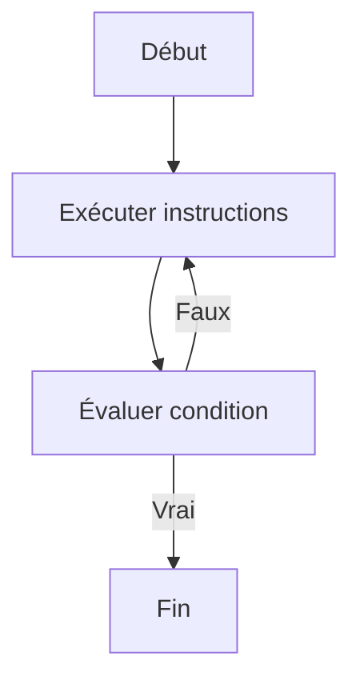

# Structures itératives  
## Boucle REPETER ... JUSQU’À  
### Utilisation de la boucle REPETER ... JUSQU’À pour des itérations avec condition à la fin

La boucle **REPETER ... JUSQU’À** permet d’exécuter un bloc d’instructions au moins une fois, puis de répéter ces instructions tant qu’une condition de sortie n’est pas satisfaite. Cette structure est caractéristique par l’évaluation de la condition **à la fin** de la boucle, garantissant ainsi l’exécution initiale du bloc.

---

## 1. Principe de la boucle REPETER ... JUSQU’À

- On **exécute d’abord** le corps de la boucle  
- Puis on **teste la condition** de sortie  
- Si la condition est fausse, la boucle recommence  
- Si la condition est vraie, la boucle s’arrête

Cette organisation est utile lorsque l’action doit s’effectuer au moins une fois, indépendamment de la condition.

---

## 2. Syntaxe en pseudo-code

```pseudo
REPETER
    instructions
JUSQU'A condition
```

- `instructions` seront effectuées au moins une fois.  
- `condition` est une expression logique qui contrôle la sortie de la boucle.

---

## 3. Exemple basique

Affichage des nombres de 1 à 5 avec la boucle REPETER ... JUSQU’À :

```pseudo
i ← 1
REPETER
    Afficher i
    i ← i + 1
JUSQU'A i > 5
```

Ici, l’affichage et l’incrémentation sont forcés d’être réalisés au moins une fois avant que la condition `i > 5` soit évaluée.

---

## 4. Exemple avec saisie utilisateur

Demander une saisie tant que l’utilisateur n’entre pas un nombre positif :

```pseudo
REPETER
    Afficher "Entrez un nombre positif :"
    Lire nombre
JUSQU'A nombre >= 0
Afficher "Merci, vous avez entré " + nombre
```

Cette construction assure que la demande de saisie sera répétée jusqu’à obtention d’une valeur valide.

---

## 5. Diagramme Mermaid illustrant la boucle REPETER ... JUSQU'À



---

## 6. Comparaison avec la boucle TANT QUE

| Critère                  | TANT QUE                                  | REPETER ... JUSQU’À                   |
|--------------------------|------------------------------------------|-------------------------------------|
| Évaluation condition     | En début de boucle                       | En fin de boucle                    |
| Nombre minimum d’exécutions | 0 (peut ne pas s’exécuter)              | 1 (s’exécute au moins une fois)    |
| Usage typique             | Répéter tant qu’une condition est vraie | Répéter jusqu’à ce qu’une condition soit vraie |

---

## 7. Points à retenir

- La boucle REPETER ... JUSQU’À garantit une première exécution du bloc.  
- Utile pour les cas où l’action doit se faire avant la vérification d’une condition (exemple : saisie utilisateur).  
- Il convient de s’assurer que la condition deviendra vraie à terme pour éviter une boucle infinie.

---

## Sources utilisées

- [OpenClassrooms - Les boucles](https://openclassrooms.com/fr/courses/6204541-initiez-vous-a-lalgorithmique/6262636-les-boucles)  
- [Wikipedia - Boucle do while (équivalent de REPETER ... JUSQU’À)](https://fr.wikipedia.org/wiki/Boucle_do_while)  
- [Developpez.com - Algorithme et structures itératives](https://algorithmique.developpez.com/cours/boucles/#Boucles_repetera_jusqu_a)  

---

La boucle **REPETER ... JUSQU’À** est un outil simple mais puissant, permettant d’assurer qu’un traitement est effectué au moins une fois avant de vérifier la condition de continuation, ce qui facilite la gestion des entrées et des événements dans un algorithme.