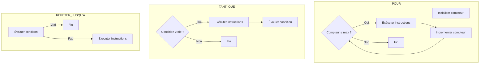

# Structures itératives  
## Choix de la bonne structure  
### Critères pour choisir la boucle la plus adaptée au problème donné

En algorithmique, les structures itératives permettent d’exécuter un bloc d’instructions plusieurs fois. Trois types de boucles couramment utilisées sont :

- **POUR** (for)  
- **TANT QUE** (while)  
- **REPETER … JUSQU’À** (do … while)

Le choix de la boucle à utiliser dépend du contexte et de la nature des itérations à effectuer. Cet article présente les critères principaux pour choisir la structure itérative la plus adaptée.

---

## 1. Connaissance préalable du nombre d’itérations

- **Boucle POUR** :  
  Utilisée lorsque le nombre d'itérations est déterminé à l’avance ou défini par un intervalle connu.  
  Exemple : Parcourir une liste de 10 éléments.

  ```pseudo
  POUR i DE 1 A 10 FAIRE
      Afficher i
  FIN POUR
  ```
  
- **Boucle TANT QUE** ou **REPETER … JUSQU’À** :  
  Utilisées quand le nombre d’itérations dépend d’une condition dynamique, non prédéfinie.

---

## 2. Position de la condition dans la boucle

| Boucle             | Évaluation de la condition | Conséquence                          |
|--------------------|----------------------------|------------------------------------|
| **TANT QUE**       | En début                   | Peut ne pas s’exécuter si condition fausse dès le départ |
| **REPETER ... JUSQU’À** | En fin                     | Exécutée au moins une fois           |

---

## 3. Exemples illustratifs

### a. Boucle POUR — nombre fixe d’itérations

Calcul de la somme des entiers de 1 à 5 :

```pseudo
somme ← 0
POUR i DE 1 A 5 FAIRE
    somme ← somme + i
FIN POUR
Afficher somme  // Affiche 15
```

### b. Boucle TANT QUE — condition préalable

Saisie d’un nombre strictement positif :

```pseudo
Lire nombre
TANT QUE nombre <= 0 FAIRE
    Afficher "Saisissez un nombre positif."
    Lire nombre
FIN TANT QUE
```

Si dès le départ `nombre > 0`, la boucle ne s’exécute pas.

### c. Boucle REPETER ... JUSQU’À — condition postérieure

Saisie d’un nombre positif, avec exécution garantie du corps au moins une fois :

```pseudo
REPETER
    Afficher "Saisissez un nombre positif."
    Lire nombre
JUSQU’A nombre > 0
```

---

## 4. Diagramme Mermaid : comparaison des trois structures



---

## 5. Résumé des critères de choix

| Critère                           | Boucle adaptée         | Pourquoi                              |
|----------------------------------|-----------------------|-------------------------------------|
| Nombre fixe d’itérations connu   | POUR                  | Simple, compteur intégré             |
| Condition à vérifier avant exécution | TANT QUE             | Exécutée seulement si condition vraie |
| Condition à vérifier après exécution | REPETER ... JUSQU’À   | Garantit une exécution minimale (au moins une fois) |

---

## 6. Conseils pratiques

- Si vous pouvez compter vos itérations, préférez la boucle POUR pour clarté et simplicité.  
- Si la continuité dépend d’une condition et qu’il faut vérifier avant toute exécution, employez TANT QUE.  
- Si au moins une exécution doit avoir lieu avant la vérification, la boucle REPETER ... JUSQU’À est recommandée.  
- Veillez à toujours modifier les variables conditionnelles dans la boucle pour éviter les boucles infinies.

---

## Sources utilisées

- [OpenClassrooms - Les boucles](https://openclassrooms.com/fr/courses/6204541-initiez-vous-a-lalgorithmique/6262636-les-boucles)  
- [Wikipedia - Boucle for, while, do while](https://fr.wikipedia.org/wiki/Boucle_for)  
- [Developpez.com - Choisir sa boucle](https://algorithmique.developpez.com/cours/boucles/#Choix_boucle)  

---

Le choix de la structure itérative repose sur la compréhension du fonctionnement des boucles et du contexte du problème. Une sélection adaptée accroît la lisibilité, la robustesse et l’efficacité du programme.